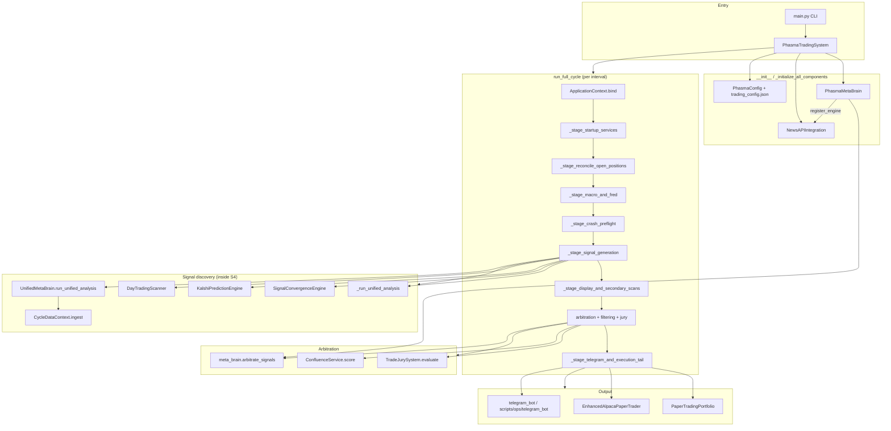

# Phasma AI — Project As-Is Breakdown

> Generated: 2026-06-19 | Entry point: `main.py` | Config: `config.json`  
> Scope: Active codebase (excludes `archive/`, `__pycache__/`, `.git/`). ~306 Python modules inventoried.

---

## Executive Summary

**Phasma AI** is a monolithic Python asyncio trading system centered on `PhasmaTradingSystem` in `main.py` (~7,235 lines). In production default mode it runs **24/7 continuous cycles** (`run_continuous`, 5-minute interval) that: refresh market caches → run macro/crash preflight → ingest news via **UnifiedMetaBrain** → generate and filter signals → arbitrate through **PhasmaMetaBrain** → pass a **TradeJurySystem** review → post to **Telegram** and optionally execute **Alpaca paper trades**. The system targets **stocks + Kalshi prediction markets** (Kalshi intel-only by default; options and sports betting configured but largely disabled or unwired). The repo contains **~86 engine modules** and **~70 utils**, but only **~25–30 are actively exercised** in the main cycle; many others are legacy integration stubs, imported-but-unused top-level imports, or demo-only code under `scripts/` and `brains/`.

---

## Architecture Diagram



---

## Directory Map

| Directory | Purpose |
|-----------|---------|
| **`/`** | `main.py` (sole production orchestrator), `config.json`, `telegram_bot.py` (re-export), `yfinance.py` (local shim) |
| **`brain/`** | Meta-intelligence: `PhasmaMetaBrain`, `UnifiedMetaBrain`, convergence, thematic analysis, scanners |
| **`brains/`** | Alternate "three-mind" framework — **demo-only**, not wired to `main.py` |
| **`core/`** | Config (`PhasmaConfig`), `ApplicationContext`, trade classifier/logger/DB, runtime paths |
| **`engines/`** | ~86 analysis/execution engines (news, Kalshi, crash, insider, options, etc.) |
| **`trading/`** | Signal framework, AI integration helpers, `UnifiedTradingSystem` |
| **`utils/`** | ~70 helpers: price fetchers, memory, filters, exit managers, resolvers |
| **`services/`** | `ConfluenceService`, `StrictConfluenceService` |
| **`config/`** | `trading_config.json`, `partnership_engine.json`, `environment.py`, `secure_config.py` |
| **`data/`** | Runtime JSON/SQLite state, company reference, paper portfolio, portfolio |
| **`data/runtime/`** | Canonical location for `phasma_state.json`, `trade_memory.json`, engine state (via `core/runtime_paths.py`) |
| **`scripts/`** | Alternate mains, demos, legacy one-offs, ops (`production_launcher`, `telegram_bot`) |
| **`scripts/alternate_mains/`** | Historical entry points (`main_production.py`, etc.) — **LEGACY** |
| **`scripts/legacy/`** | Integration experiments, debug scripts — **DEAD for production** |
| **`integrations/`** | `elon_musk_scraper.py`, `feedbin_api.py` — peripheral, not in main cycle |
| **`compliance/`** | `audit_trail.py` — instantiated, light usage |
| **`backtesting/`** | `lag_aware_backtester.py` — standalone |
| **`feedback_analysis/`** | `analyze_feedback.py` — standalone |
| **`docs/`** | Prior notes, tickets, news_access docs |
| **`waves/`** | Text roadmaps (`wave_*.txt`) — planning artifacts, no code |
| **`logs/`** | Runtime logs (`phasma_trading.log` written at repo root by default) |
| **`archive/`** | Old configs, moved code — **skipped** |

**Note:** There is no `execution/` package; execution lives in `main.py` methods and `engines/enhanced_alpaca_trader.py`.

---

## File-by-File Inventory

### Root

| File | Purpose | Key symbols | R/W | Status |
|------|---------|-------------|-----|--------|
| `main.py` | **Production orchestrator** — `PhasmaTradingSystem`, full cycle pipeline, CLI | `PhasmaTradingSystem`, `run_full_cycle`, `parse_arguments` | R: all configs/data; W: state, logs, Telegram | **ACTIVE** |
| `config.json` | Primary runtime config (bankroll, APIs, jury, Kalshi, strategies) | — | R | **ACTIVE** |
| `telegram_bot.py` | Re-exports `get_telegram_bot` from `scripts/ops/telegram_bot.py` | `get_telegram_bot` | — | **ACTIVE** (indirect) |
| `yfinance.py` | Local yfinance wrapper/shim at repo root | — | — | **ACTIVE** (imported by utils) |

### `core/`

| File | Purpose | Key symbols | R/W | Status |
|------|---------|-------------|-----|--------|
| `config.py` | **Canonical** `PhasmaConfig` — nested keys, defaults, `apply_max_discovery_overrides` | `PhasmaConfig` | R/W `config.json` | **ACTIVE** |
| `application_context.py` | Per-cycle shared context for staged pipeline | `ApplicationContext.bind` | — | **ACTIVE** |
| `runtime_paths.py` | Paths for `data/runtime/`, memory, engine state; legacy migration | `memory_path`, `phasma_state_file`, `engine_state_path` | R/W runtime JSON | **ACTIVE** |
| `trade_classifier.py` | Trade class assignment (SWING, etc.) | `TradeClassifier`, `TradeClass` | — | **ACTIVE** (via `classify_trade`) |
| `trade_logger.py` | Structured trade decision logging | `TradeLogger` | W logs | **ACTIVE** |
| `trade_database.py` | SQLite trade persistence | `TradeDatabase` | R/W DB | **IMPORTED but `trade_db` never set on system** — **DEAD hook** |
| `emergent_order_theory.py` | Emergent order patterns | — | — | **DEAD** (not imported in main) |
| `__init__.py` | Exports core types | — | — | **ACTIVE** |

### `brain/`

| File | Purpose | Key symbols | R/W | Status |
|------|---------|-------------|-----|--------|
| `meta_brain.py` | **Signal arbitration**, risk manager, engine registry, `Signal` class; **also embeds duplicate `PhasmaConfig`** | `PhasmaMetaBrain`, `Signal` | R/W `phasma_state.json` | **ACTIVE** |
| `unified_meta_brain.py` | **Per-cycle discovery orchestrator** — news ingest, intelligence tasks, convergence | `UnifiedMetaBrain.run_unified_analysis` | W optional unified results | **ACTIVE** (lazy `_unified_brain`) |
| `signal_convergence_engine.py` | Multi-source signal convergence scoring | `SignalConvergenceEngine` | — | **ACTIVE** |
| `thematic_analysis_engine.py` | Macro theme → stock mapping | `ThematicAnalyzer` | — | **ACTIVE** (skipped when `cycle_data` present) |
| `market_intelligence_engine.py` | Market intelligence aggregation | `MarketIntelligenceEngine` | — | **IMPORTED, never instantiated** — **DEAD import** |
| `news_driven_scanner.py` | News-driven stock discovery | `NewsDrivenScanner` | — | **ACTIVE** (via UnifiedMetaBrain) |
| `bull_run_detector.py` | Multi-source bull run confirmation | `BullRunDetector` | — | **ACTIVE** (via UnifiedMetaBrain) |
| `universal_trading_intelligence.py` | 15-strategy universal intel | `UniversalTradingIntelligence` | — | **ACTIVE** (via UnifiedMetaBrain) |
| `__init__.py` | Package init | — | — | **ACTIVE** |

### `brains/` (alternate framework)

| File | Purpose | Status |
|------|---------|--------|
| `three_mind_framework.py` | Three-mind decision framework | **LEGACY** — `config.trading.three_mind_enabled: true` but **not wired in main.py** |
| `three_mind_integration.py` | Integrates three-mind into unified results | **LEGACY** — only `scripts/demos/demo_three_mind.py` |
| `macro_navigator.py` | Macro navigation helper | **DEAD** |
| `micro_execution_engine.py` | Micro execution logic | **DEAD** |
| `value_selector.py` | Value stock selection | **DEAD** |

### `trading/`

| File | Purpose | Key symbols | Status |
|------|---------|-------------|--------|
| `unified_trading_system.py` | Quick trade vs thesis routing | `UnifiedTradingSystem.run_unified_analysis` | **ACTIVE** (called mid-cycle in `_stage_signal_generation`) |
| `signal_framework.py` | `TradingSignal`, tiers, risk params | `SignalProcessor`, `SignalTier` | **IMPORTED, unused in main** — **DEAD import** |
| `ai_integration.py` | AI model output, decision engine | `TradingDecisionEngine`, `SignalGenerator` | **IMPORTED, unused** — **DEAD import** |

### `services/`

| File | Purpose | Status |
|------|---------|--------|
| `confluence_service.py` | Centralized confluence scoring (insider, options, strategy profiles) | **ACTIVE** — `_stage_streamlined_signal_filtering` |
| `strict_confluence_service.py` | Stricter variant | **DEAD** — not imported in main |

### `compliance/`

| File | Purpose | Status |
|------|---------|--------|
| `audit_trail.py` | `ComplianceLogger` | **ACTIVE** — instantiated; light logging |

### `config/`

| File | Purpose | Status |
|------|---------|--------|
| `trading_config.json` | Budget, symbol sources, data source prefs | **ACTIVE** — merged into `self.config` at init |
| `partnership_engine.json` | Partnership scanner config | **ACTIVE** — if partnership engine loads |
| `environment.py` | `.env` template generator with embedded example keys | **LEGACY helper** — contains hardcoded example API keys |
| `secure_config.py` | Secure config loader | **DEAD** for main path |

### `scripts/` (summary)

| Path | Status |
|------|--------|
| `scripts/ops/telegram_bot.py` | **ACTIVE** — real Telegram implementation |
| `scripts/ops/production_launcher.py`, `phasma_preflight_check.py` | **OPS** — manual launch |
| `scripts/alternate_mains/*.py` | **LEGACY** alternate entry points |
| `scripts/demos/*.py` | **DEMO only** |
| `scripts/legacy/*.py` | **DEAD** — ~80 integration/debug scripts |
| `scripts/monitoring/monitor.py` | **LEGACY** external monitor |

### `integrations/`

| File | Status |
|------|--------|
| `elon_musk_scraper.py` | **DEAD** — not in main cycle |
| `feedbin_api.py` | **DEAD** |

### `backtesting/` & `feedback_analysis/`

| File | Status |
|------|--------|
| `lag_aware_backtester.py` | **STANDALONE** — not in main cycle |
| `analyze_feedback.py` | **STANDALONE** |

---

## `engines/` Catalog

Status key: **WIRED** = instantiated on `PhasmaTradingSystem` and called in cycle; **REGISTERED** = registered with meta_brain only; **IMPORT-ONLY** = imported in main.py but never `self.x =`; **LATENT** = exists, not imported by main; **DISABLED** = config off.

| Engine module | Role | Wired status |
|---------------|------|--------------|
| `news_engine_core.py` (+ apis, integrated, analysis, utils, validation, memory) | Multi-source news via `NewsAPIIntegration` | **WIRED** |
| `kalshi_engine.py` | Kalshi prediction market scan/trade logic | **WIRED** (`kalshi_enabled`) |
| `market_crash_detector_v2.py` | SPY/crypto crash risk | **WIRED** + **REGISTERED** |
| `monte_carlo_engine.py` | Stock/options simulation | **WIRED** (crash detector + day trades + unified analysis) |
| `global_macro_monitor.py` | Japan yields, macro crash alerts | **WIRED** |
| `pump_dump_detector.py` | Pump/dump pattern analysis | **WIRED** (telegram tail) |
| `insider_signal_integrator.py` | Insider confluence | **WIRED** |
| `form4_parser.py` | SEC Form 4 parsing | **WIRED** (init only; light direct use) |
| `options_flow_filter.py` | Options flow filtering | **WIRED** (via ConfluenceService) |
| `enhanced_options_flow_detector.py` | Multi-source options flow | **WIRED** (init) |
| `human_validator.py` | Human-in-loop validation hooks | **WIRED** (init) |
| `day_trading_scanner.py` | Momentum day-trade candidates | **WIRED** |
| `paper_trading_portfolio.py` | Internal paper portfolio | **WIRED** (fallback) |
| `enhanced_alpaca_trader.py` | Alpaca paper API | **WIRED** (primary when keys present) |
| `alpaca_paper_trader.py` | Older Alpaca wrapper | **IMPORTED** — superseded by enhanced |
| `auto_exit_manager.py` | Automated exits | **WIRED** (broker hook) |
| `real_portfolio_manager.py` | Real P&L tracking JSON | **WIRED** |
| `market_hours_detector.py` | Market open/close | **WIRED** |
| `smart_trading_strategy.py` | Strategy selection | **WIRED** (init) |
| `geopolitical_analyzer.py` | Geo event impact | **WIRED** |
| `multi_platform_scanner.py` | Multi-platform geo scan | **WIRED** (init) |
| `geopolitical_monitor.py` | Geo news monitor | **WIRED** (conditional import) |
| `underground_stock_discovery.py` | Small-cap hidden gems | **WIRED** (`underground_discovery.enabled`) |
| `partnership_engine/` | SAM.gov / EDGAR partnerships | **WIRED** (async monitor) |
| `social_engine/` | Reddit/Stocktwits/X trending | **WIRED** (`RedditTrendingTracker`) |
| `unusual_whales_engine.py` | Unusual options API | **WIRED** (`unusual_whales.enabled`) |
| `trade_jury_system.py` | Multi-chamber jury | **WIRED** (per-cycle instantiate) |
| `adaptive_confidence_threshold.py` | Dynamic confidence floor | **WIRED** |
| `daily_learning_tracker.py` | Daily performance tracking | **WIRED** |
| `options_engine.py` | Full options engine | **DISABLED** (`options_enabled: false`) |
| `risk_engine.py` | Risk sizing | **ACTIVE** via UnifiedMetaBrain + meta_brain |
| `market_regime.py` | Regime detection | **ACTIVE** via UnifiedMetaBrain |
| `silver_price_monitor.py` | Silver commodity signals | **IMPORT-ONLY** — `s.silver_monitor` **never set** — **BROKEN reference** |
| `advanced_sentiment_engine.py` | Sentiment scoring | **IMPORT-ONLY** — **DEAD** |
| `risk_guardian_meta_agent.py` | Emergency kill switch agent | **IMPORT-ONLY** — **DEAD** |
| `volatility_edge_engine.py` | IV vs realized edge | **IMPORT-ONLY** — **DEAD** |
| `self_calibrating_probability_engine.py` | Probability calibration | **IMPORT-ONLY** — **DEAD** |
| `iv_crush_predictor.py` | Post-earnings IV crush | **IMPORT-ONLY** — **DEAD** |
| `exit_optimizer.py` | Exit optimization | **IMPORT-ONLY** — **DEAD** |
| `microstructure_engine.py` | Microstructure analysis | **IMPORT-ONLY** — **DEAD** |
| `spread_builder.py` | Options spreads | **IMPORT-ONLY** — **DEAD** |
| `correlation_tracker.py` | Cross-asset correlation | **IMPORT-ONLY** — **DEAD** |
| `scenario_graph_engine.py` | Scenario graphs | **IMPORT-ONLY** — **DEAD** (state file exists) |
| `cross_venue_radar.py` | Cross-venue mispricing | **IMPORT-ONLY** — **DEAD** |
| `top_10_dashboard.py` | Top-10 opportunities dashboard | **IMPORT-ONLY** — **DEAD** |
| `causal_counterfactual_engine.py` | Causal/counterfactual | **IMPORT-ONLY** — **DEAD** |
| `calendar_seasonality_engine.py` | Calendar seasonality | **IMPORT-ONLY** — **DEAD** |
| `earnings_drift_engine.py` | Earnings drift | **IMPORT-ONLY** — **DEAD** |
| `macro_calendar_engine.py` | Macro calendar events | **IMPORT-ONLY** — **DEAD** |
| `corporate_actions_engine.py` | Splits/dividends | **IMPORT-ONLY** — **DEAD** |
| `range_barrier_engine.py` | Range/barrier options | **IMPORT-ONLY** — **DEAD** |
| `smart_monte_carlo.py` | Enhanced Monte Carlo | **IMPORT-ONLY** — **DEAD** |
| `advanced_geopolitical_thinker.py` | Deep geo reasoning | **DISABLED** — `geo_thinker = None` |
| `sports_odds_integration.py` | Sports betting | **LATENT** (`sports_betting.enabled` in config, not in main) |
| `dynamic_market_scanner.py` | Broad market scan | **LATENT** |
| `undervalued_stock_scanner.py` | Value scan | **LATENT** |
| `sector_intelligence_engine.py` | Sector correlations | **LATENT** (enabled only in 24h demo flags) |
| `sector_bias_breaker.py` | Anti top-3 bias | **LATENT** |
| `expansion_engine.py` | New symbol expansion | **LATENT** |
| `whale_activity_tracker.py` | Whale tracking | **LATENT** |
| `catalyst_tracker.py` | Catalyst tracking | **LATENT** |
| `commodity_news_scanner.py` | Commodity news | **LATENT** |
| `long_tier/` | Long-horizon tier engine | **LATENT** |
| `trade_analyzer/` | Trade analysis package | **LATENT** (empty `__init__`) |
| `ultimate_integration.py` | Legacy "ultimate" glue | **LEGACY DEAD** |
| `final_100_percent_integration.py` | Legacy integration | **LEGACY DEAD** |
| `refactored_integration.py` | Legacy integration | **LEGACY DEAD** |
| `complete_data_integration.py` | Legacy data glue | **LEGACY DEAD** |
| `fixed_data_integration.py` | Legacy data glue | **LEGACY DEAD** |
| `enhanced_free_integration.py` | Legacy free APIs | **LEGACY DEAD** |
| `secure_data_integration.py` | Legacy secure APIs | **LEGACY DEAD** |
| `data_integration.py` | Generic data integration | **LEGACY DEAD** |
| `execution_checker_v2.py` | Pre-trade execution checks | **LATENT** (ticket US-003) |
| `backtest_engine.py` | Backtesting | **STANDALONE** |
| `paper_trading_verifier.py` | Paper trade verification | **LATENT** |
| `enhanced_confluence_scorer.py` | Alt confluence | **LATENT** |
| `market_research_engine.py` | Research aggregation | **LATENT** |
| `news_collection_network.py` | 24/7 news collection | **LATENT** (`auto_start_news_collection` default false) |
| `finnhub_news.py`, `iex_cloud_integration.py`, `sec_edgar_integration.py` | Data provider adapters | **LATENT** (used inside news stack) |
| `real_company_data.py` | Company validation | **LATENT** (news engine) |
| `silver_detector.py` | Silver detection helper | **LATENT** |

---

## `utils/` Modules (significant)

| Module | Purpose | Status in main |
|--------|---------|----------------|
| `price_fetcher.py` / `robust_price_fetcher.py` | Price retrieval | **ACTIVE** / init only |
| `market_data_cache.py` | Batch price/macro cache | **ACTIVE** |
| `infinite_symbol_provider.py` | Large symbol universe | **ACTIVE** (init) |
| `cycle_data_context.py` | Per-cycle news/price ingest | **ACTIVE** |
| `company_resolver.py` | Ticker/company enrichment | **ACTIVE** |
| `trade_memory.py` | Cooldown / recent trades | **ACTIVE** (3 import aliases) |
| `trade_recommendation_memory.py` | Past recommendation bullets | **ACTIVE** (Telegram context) |
| `affordable_stock_filter.py` | Price-cap filtering | **ACTIVE** |
| `price_filter_config.py` | Price filter resolution | **ACTIVE** |
| `prediction_market_filters.py` | Kalshi intel-only gating | **ACTIVE** |
| `moon_shot_detector.py` | Moonshot scoring | **ACTIVE** |
| `adaptive_position_sizer.py` | Position sizing | **ACTIVE** |
| `volatility_burst_detector.py` | Vol burst alerts | **ACTIVE** (telegram tail) |
| `alert_router.py` | Alert routing | **ACTIVE** (telegram tail) |
| `winners_gallery.py` | Winner showcase Telegram posts | **ACTIVE** |
| `insider_opportunity_analyzer.py` | Insider opportunities | **ACTIVE** |
| `politician_tracker.py` | Politician trade tracking | **ACTIVE** |
| `exit_strategy_manager.py` | Exit rules | **ACTIVE** (init) |
| `simulation_exit_manager.py` | Sim position exits | **ACTIVE** |
| `profit_maximization_exit_manager.py` | Trailing profit exits | **DISABLED** |
| `strategy_cue_cards.py` | Strategy suggestions | **ACTIVE** |
| `news_impact_tracker.py` | News impact DB | **ACTIVE** (init) |
| `skipped_opportunity_watchlist.py` | Revisit skipped symbols | **ACTIVE** |
| `alert_learning_loop.py` | Alert feedback learning | **INIT ONLY** |
| `dynamic_profit_targets.py` | Profit target calc | **ACTIVE** (Telegram) |
| `dynamic_portfolio_manager.py` | Portfolio dynamics | **IMPORT-ONLY DEAD** |
| `pe_ratio_analyzer.py` | P/E value analysis | **IMPORT-ONLY DEAD** |
| `thesis_manager.py` | Long thesis storage | **ACTIVE** via UnifiedTradingSystem only |
| `randomness_pattern_analyzer.py` | Randomness patterns | **IMPORT-ONLY DEAD** |
| `volatility_lookup.py` | Vol lookup table | **IMPORT-ONLY DEAD** |
| `fred_economic_filter.py` | FRED macro regime | **ACTIVE** (if `FRED_API_KEY`) |
| `discovery_limits.py` | Max-discovery caps | **ACTIVE** |
| `weekly_watchlist.py` | Weekly watchlist | **REMOVED** (comment in main) |
| `why_moving_strip.py` | "Why moving" strip | **DISABLED** (comment) |
| `sec_edgar_provider.py`, `openinsider_scraper.py` | SEC/insider data | **LATENT** (insider stack) |
| `shadow_journal.py`, `zero_ghost_enforcer.py`, `strict_reality_architecture.py` | Strictness enforcement | **LATENT** |
| `galton_mindset.py` | Galton board mindset | **LATENT** |
| `trader_performance_tracker.py`, `trader_call_logger.py` | Performance logging | **ACTIVE** (logger) / latent |

---

## Feature Inventory

| # | Feature | Status |
|---|---------|--------|
| 1 | 24/7 continuous trading cycles (default CLI) | **ACTIVE** in `main.py` |
| 2 | Learning-only mode (`--learning-only`) | **ACTIVE** |
| 3 | Status / position review (`--status`, `--review`) | **ACTIVE** |
| 4 | 24-hour demo/production modes (`--24hour-demo`, `--24hour`) | **ACTIVE** |
| 5 | UnifiedMetaBrain multi-source discovery | **ACTIVE** |
| 6 | PhasmaMetaBrain signal arbitration | **ACTIVE** |
| 7 | News API multi-source ingestion (20+ feeds) | **ACTIVE** |
| 8 | CycleDataContext single-ingest per cycle | **ACTIVE** |
| 9 | Market data cache batch refresh | **ACTIVE** |
| 10 | Global macro monitor (crash risk) | **ACTIVE** |
| 11 | FRED economic regime filter | **ACTIVE** (needs env key) |
| 12 | Market crash detector V2 | **ACTIVE** |
| 13 | Day trading momentum scanner | **ACTIVE** |
| 14 | Day-trade direct Telegram posting (pre-jury) | **ACTIVE** — dual path |
| 15 | Kalshi market scanning | **ACTIVE** |
| 16 | Kalshi intel-only digest (no trade posts) | **ACTIVE** (`kalshi_intel_only`) |
| 17 | Signal convergence engine (multi-source) | **ACTIVE** |
| 18 | Thematic analysis engine | **ACTIVE** (conditional skip) |
| 19 | Underground stock discovery | **ACTIVE** |
| 20 | Partnership engine monitoring | **ACTIVE** |
| 21 | Social Reddit trending | **ACTIVE** |
| 22 | Unusual Whales options flow | **ACTIVE** (needs API key) |
| 23 | Insider monitor + integrator | **ACTIVE** |
| 24 | Politician trade tracker | **ACTIVE** |
| 25 | Geopolitical analysis pipeline | **ACTIVE** |
| 26 | ConfluenceService strategy scoring | **ACTIVE** |
| 27 | Trade jury system (3 chambers) | **ACTIVE** |
| 28 | Adaptive confidence threshold | **ACTIVE** |
| 29 | Monte Carlo stock simulation | **ACTIVE** |
| 30 | Pump/dump detector | **ACTIVE** |
| 31 | Moon shot detector | **ACTIVE** |
| 32 | Adaptive position sizer | **ACTIVE** |
| 33 | Telegram trade alerts | **ACTIVE** (`telegram_enabled`) |
| 34 | Winners gallery Telegram posts | **ACTIVE** |
| 35 | Volatility burst alerts | **ACTIVE** |
| 36 | Alpaca paper trading execution | **ACTIVE** (if keys) |
| 37 | Internal paper portfolio fallback | **ACTIVE** |
| 38 | Auto exit manager | **ACTIVE** (sim/Alpaca) |
| 39 | Real portfolio JSON tracking | **ACTIVE** |
| 40 | Open position reconciliation | **ACTIVE** |
| 41 | Skipped opportunity revisit queue | **ACTIVE** |
| 42 | Daily learning tracker | **ACTIVE** |
| 43 | News deduplication / posted_signals persistence | **ACTIVE** |
| 44 | Crypto ecosystem confidence boost | **ACTIVE** (`_apply_ecosystem_interactions`) |
| 45 | UnifiedTradingSystem quick/thesis routing | **ACTIVE** (mid-cycle) |
| 46 | Options engine | **DISABLED** (`options_enabled: false`) |
| 47 | Profit maximization exits | **DISABLED** |
| 48 | Three-mind framework | **LEGACY** (config on, not wired) |
| 49 | Sports betting / odds | **LEGACY** (config on, not in main) |
| 50 | Signal framework (`TradingSignal`/`SignalProcessor`) | **IMPORTED unused** |
| 51 | AI integration (`TradingDecisionEngine`) | **IMPORTED unused** |
| 52 | 20+ advanced engines (sentiment, microstructure, etc.) | **IMPORTED unused** |
| 53 | Silver price monitor | **BROKEN** (referenced, never init) |
| 54 | TradeDatabase persistence | **BROKEN** (`trade_db` never set) |
| 55 | MarketIntelligenceEngine | **IMPORTED unused** |
| 56 | Advanced geopolitical thinker | **DISABLED** explicitly |
| 57 | Conviction watchlist | **DISABLED** in code |
| 58 | Price filter (share cap) | **DISABLED** (`price_filter_enabled: false`) |
| 59 | Max discovery mode | **ACTIVE** (`max_discovery: true`) |
| 60 | Compliance audit trail | **ACTIVE** (light) |
| 61 | Human validator gate | **INIT ONLY** |
| 62 | Paper trading auto-trade on signals | **ACTIVE** (`paper_trading.auto_trade_signals`) |
| 63 | Value investing P/E analysis | **LATENT** (`_generate_value_investing_reasoning` exists) |
| 64 | Strict confluence service | **DEAD** |
| 65 | Backtesting / lag-aware backtester | **STANDALONE** |

**Feature count: 65** (32 fully active in main cycle, 8 disabled/broken, 10 imported-unused, 15 latent/legacy/standalone)

---

## Runtime Flow

### Startup (`PhasmaTradingSystem.__init__`)

1. Load `PhasmaConfig("config.json")`; apply `max_discovery` overrides.
2. Merge `config/trading_config.json` into config object.
3. Instantiate `PhasmaMetaBrain`, `NewsAPIIntegration`.
4. `_initialize_all_components()`:
   - Utilities (price, alerts, insider, exits, geo, portfolio, paper trading).
   - Engines (day trading, macro, FRED, insider, Kalshi, partnership, social, cache, crash, unified system, confluence, underground, telegram, auto-exit, learning, unusual whales).
   - Register engines on meta_brain: `news`, `options` (if enabled), `partnerships`, `crash_detector`.
   - Load `phasma_state.json`; **clear phantom `open_positions`** on risk manager.
   - Send Telegram restart ping if configured.

### CLI routing (`if __name__ == "__main__"`)

| Args | Behavior |
|------|----------|
| (default) | `run_continuous(cycles, interval)` — 24/7 |
| `--learning-only` | News + memory, no trades |
| `--status` / `--review` | One-shot ops |
| `--24hour` / `--24hour-demo` | Fixed 24 cycles + feature flags |
| `--analyze N` | Trade analysis (expects `trade_db`) |

### Cycle (`run_full_cycle`)

```
_reset_cycle_caches()
ApplicationContext.bind(self)
│
├─ STAGE: preflight_and_risk
│   ├─ _stage_startup_services      → cache refresh, partnership monitor, optional news collection
│   ├─ _stage_reconcile_open_positions → close stale positions, P&L, adaptive threshold
│   ├─ _stage_macro_and_fred        → global macro + FRED regime → ctx.fred_regime
│   └─ _stage_crash_preflight       → MarketCrashDetectorV2 on tracked symbols
│
├─ STAGE: ingest & signals (_stage_signal_generation)
│   ├─ _stage_unified_brain_news_items → UnifiedMetaBrain + CycleDataContext
│   ├─ thematic analysis (skip if cycle_data)
│   ├─ day_trading_scanner + Monte Carlo + **direct Telegram day-trade posts**
│   ├─ social trending enrichment
│   ├─ kalshi_engine.scan_all_markets
│   ├─ _run_unified_analysis on news items (fact-check, sim, moonshots)
│   ├─ convergence_engine, insider, unusual whales, unified_system
│   └─ split regular_trades vs overnight_moonshots
│
├─ STAGE: secondary scans (_stage_display_and_secondary_scans)
│   ├─ news_engine rescan / reuse snapshot
│   ├─ silver_monitor (dead branch)
│   ├─ social_engine signals
│   ├─ geo_analyzer events
│   └─ underground_discovery
│
├─ STAGE: filter & execute
│   ├─ _build_signal_objects_for_arbitration → brain.Signal objects
│   ├─ _stage_prepare_arbitration_context → meta_brain.arbitrate_signals
│   ├─ _stage_streamlined_signal_filtering → ConfluenceService, price guards, moonshot
│   ├─ _stage_bankroll_intel_and_pro_options
│   ├─ _stage_jury_final_review → TradeJurySystem
│   └─ _stage_telegram_and_execution_tail
│       ├─ Kalshi intel digest
│       ├─ POP/pattern/divergence quality gates
│       ├─ vol_burst + alert_router
│       ├─ position_sizer, pump_dump, insider integrator
│       ├─ Telegram format + send
│       ├─ _execute_alpaca_trade_from_signal / _execute_paper_trade_from_signal
│       ├─ winners_gallery, insider/politician digests
│       └─ simulation_exit_manager / auto_exit_manager checks
│
└─ meta_brain.save_state(phasma_state.json)
```

### Signal → Jury → Telegram → Execution path

1. **Signal origin**: UnifiedMetaBrain opportunities, day scanner, Kalshi, news, social, insider, convergence.
2. **Normalization**: Dict signals → `brain.Signal` via `_build_signal_objects_for_arbitration`.
3. **Arbitration**: `PhasmaMetaBrain.arbitrate_signals` applies POP threshold (dynamic 30–40% based on crash level).
4. **Filtering**: Confidence ≥30%, confluence score, price caps, moonshot tagging.
5. **Jury**: `TradeJurySystem.evaluate` — evidence/risk/outcome chambers; hard veto → drop; CONDITIONAL → size multiplier.
6. **Telegram**: `send_telegram_alert` / `telegram_bot.format_*` — respects `posted_signals` cooldown, `should_block_prediction_trade_post`.
7. **Execution**: If `paper_trading.auto_trade_signals` and Alpaca connected → `_execute_alpaca_trade_from_signal`; else internal `paper_portfolio`. `execute_classified_trade` exists for classified flow but is secondary to inline execution in telegram tail.

---

## Data Layer

### Sources (read)

| Source | Module | Used by |
|--------|--------|---------|
| RSS / News APIs / social | `engines/news_engine_*` | UnifiedMetaBrain, NewsAPIIntegration |
| yfinance / Alpha Vantage / Finnhub | `utils/price_fetcher`, `market_data_cache` | Cycle prices, simulations |
| SEC EDGAR / Form 4 | `form4_parser`, `sec_edgar_integration` | Insider stack |
| FRED API | `utils/fred_economic_filter` | Macro regime |
| Alpaca IEX | `enhanced_alpaca_trader` | Paper execution + quotes |
| Kalshi API | `kalshi_engine` | Prediction markets |
| Unusual Whales API | `unusual_whales_engine` | Options flow |
| Reddit / Stocktwits | `social_engine` | Trending |
| SAM.gov / USASpending | `partnership_engine` | Partnership monitor |
| OpenInsider / politician data | `insider_*`, `politician_tracker` | Insider/geo signals |
| `data/company_reference.csv` | company_resolver | Validation |
| `data/sec_company_database.json` | news engine | Company DB |

### Caches (read/write)

| Path | Writer | Reader | Contents |
|------|--------|--------|----------|
| `data/runtime/phasma_state.json` | meta_brain.save/load | Startup, cycle end | Brain state, risk positions |
| `data/runtime/phasma_core_memory/posted_signals.json` | `_save_posted_signals` | `_load_posted_signals` | Telegram dedupe keys |
| `data/runtime/trade_memory.json` | `utils/trade_memory` | Cooldown filter | Recent trade symbols |
| `data/runtime/engine_state/*.json` | Various latent engines | Latent engines | Vol profiles, jury history, etc. |
| `data/company_validation_cache.json` | news validation | news engine | Company fact-check cache |
| In-memory `_price_cache` | Per-cycle | `_get_cached_price` | Symbol prices |
| In-memory `_seen_news_keys` | Per-cycle | `_filter_seen_news_items` | News dedupe |
| `MarketDataCache` | `refresh_cache()` | Batch fetch | Prices, macro (DXY, VIX, SPY) |
| `register_cycle_prices()` | CycleDataContext | `get_cycle_price()` | Cycle-scoped prices |

### Portfolio / trade persistence

| Path | Purpose |
|------|---------|
| `data/portfolio/real_portfolio_state.json` | RealPortfolioManager |
| `data/paper_portfolio/paper_portfolio_state.json` | Internal paper trading |
| `data/paper_portfolio/paper_trade_log.json` | Paper trade log |
| `data/trade_log.json` | TradeLogger output |
| `data/trade_recommendations.json` | Recommendation memory |
| `data/skipped_opportunities.json` | SkippedOpportunityWatchlist |
| `data/news_impact.db` | NewsImpactTracker SQLite |
| `data/partnership_engine/state.json` | Partnership scanner state |

---

## Config & Secrets Map

### `config.json` (primary)

| Key | Current value / role |
|-----|---------------------|
| `bankroll` | 100 |
| `max_discovery` | true — raises discovery limits |
| `telegram_enabled` | true |
| `options_enabled` | **false** |
| `trading_mode` | `stocks_and_kalshi` |
| `kalshi_enabled` / `kalshi_intel_only` | true / true — intel digest, block trade posts |
| `post_prediction_trades` | false |
| `paper_trading.enabled` | true |
| `paper_trading.auto_trade_signals` | true |
| `jury_system` | enabled, composite thresholds |
| `strategies.active_strategy` | `penny_moonshot` |
| `apis.alpha_vantage` | enabled (key in file — **rotate**) |
| `unusual_whales` | enabled (placeholder key) |
| `sports_betting.enabled` | true (**unwired**) |
| `trading.three_mind_enabled` | true (**unwired**) |

### `config/trading_config.json`

- `trading_budget.max_price_per_share`: 1000
- `symbol_sources.use_infinite_symbols`: true
- Data source primary: yfinance

### Environment variables (via `load_dotenv()` + code)

| Variable | Consumer |
|----------|----------|
| `FRED_API_KEY` | FRDEconomicFilter |
| `ALPACA_API_KEY`, `ALPACA_API_SECRET`, `ALPACA_BASE_URL` | EnhancedAlpacaPaperTrader |
| `TELEGRAM_BOT_TOKEN`, `TELEGRAM_CHAT_ID` | scripts/ops/telegram_bot |
| `UNUSUAL_WHALES_API_KEY` | UnusualWhalesEngine |
| Kalshi credentials | kalshi_engine (env/config) |
| Various news API keys | news_engine_apis |
| `DATABASE_URL` / SQLite | TradeDatabase (**unused in main**) |

### Secret hygiene notes

- `config.json` and `config/environment.py` contain **plaintext placeholder or example API keys** — treat as compromised templates.
- Production secrets should live in `.env` only; not all keys are consistently read from env vs config.

---

## Known Collisions & Gaps

### Dual execution paths

1. **Day-trading Telegram posts** fire inside `_stage_signal_generation` **before** arbitration/jury — can alert on signals that would later be rejected.
2. **PhasmaMetaBrain vs UnifiedMetaBrain**: two brains; Unified discovers, Meta arbitrates. Risk manager state cleared on startup but both may track positions differently (`real_portfolio` vs `meta_brain.risk_manager.open_positions`).
3. **Alpaca vs internal paper portfolio**: Alpaca preferred; fallback portfolio may diverge from Alpaca account state.

### Broken / dangling references

| Issue | Evidence |
|-------|----------|
| `s.silver_monitor` never assigned | Referenced in `_stage_display_and_secondary_scans`; import exists; `add_silver_monitor_to_system()` never called |
| `s.trade_db` never assigned | `execute_classified_trade`, `analyze_trades` check `self.trade_db` |
| 20+ engine imports at top of main never instantiated | Lines 79–102 imports; no `self.*` assignment |
| `generate_unified_trade_summaryy` / `summarry` | Typo duplicate methods (lines 1333–1337) — dead aliases |
| Phantom position wipe | `meta_brain.risk_manager.open_positions = {}` every startup — masks stale state bugs |

### Duplication

| Item | Locations |
|------|-----------|
| `PhasmaConfig` class | `core/config.py` (**used**) vs `brain/meta_brain.py` (**duplicate**) |
| `get_trade_memory` | Imported 3× as different aliases in main.py |
| `Signal` class | `brain/meta_brain.py` vs `trading/signal_framework.TradingSignal` |
| News pipeline | `NewsAPIIntegration` + `IntegratedNewsSources` inside UnifiedMetaBrain |
| Confluence | `ConfluenceService` + `SignalConvergenceEngine` + confluence inside UnifiedMetaBrain |
| Integration glue files | `ultimate_integration`, `final_100_percent_integration`, `refactored_integration`, etc. |

### Config vs code mismatches

- `three_mind_enabled: true` — no import of `brains/three_mind_integration` in main.
- `sports_betting.enabled: true` — `sports_odds_integration` not in main cycle.
- `options_enabled: false` — options analysis code paths partially remain in unified analysis display.
- `profit_maximization.enabled: false` — manager not created.
- Bankroll inconsistency: config `100` vs hardcoded `self.bankroll = 2000` at end of `run_full_cycle`.

### Unused but initialized (memory/startup cost)

`alert_learning`, `robust_price_fetcher` (partial), `human_validator`, `form4_parser`, `compliance_logger`, `smart_strategy`, `geo_scanner`, `news_impact_tracker` — created every boot, minimal cycle use.

---

## Integration Matrix (who calls whom)

```
main.py (PhasmaTradingSystem)
├── PhasmaConfig ← config.json, trading_config.json
├── PhasmaMetaBrain
│   ├── arbitrate_signals ← Signal objects from pipeline
│   ├── risk_manager (positions, bankroll, P&L)
│   └── registered: news_engine, options_engine?, partnership_engine, crash_detector
├── NewsAPIIntegration ← config
├── UnifiedMetaBrain (lazy _unified_brain)
│   ├── IntegratedNewsSources ← CycleDataContext.ingest
│   ├── UniversalTradingIntelligence, BullRunDetector, NewsDrivenScanner
│   ├── PhasmaRiskEngine, PhasmaMarketRegimeDetector
│   └── underground, partnership, social (internal)
├── ApplicationContext → stages read ctx.config, ctx.market_cache, ctx.fred_*
├── ConfluenceService ← insider_integrator, insider_monitor, options_filter
├── SignalConvergenceEngine ← add_signal / find_convergence_opportunities
├── UnifiedTradingSystem ← run_unified_analysis (mid-cycle)
├── KalshiPredictionEngine ← scan_all_markets
├── DayTradingScanner ← scan_momentum_stocks
├── get_monte_carlo_engine ← simulations
├── TradeJurySystem ← evaluate (per signal, per cycle)
├── RealPortfolioManager ← bankroll, P&L display
├── EnhancedAlpacaPaperTrader / PaperTradingPortfolio ← execution
├── telegram_bot ← send_message, format_* 
├── AutoExitManager ← broker_api = alpaca
├── MarketDataCache ← refresh_cache, fetch_prices
├── utils.* ← price, memory, filters, resolvers (throughout stages)
└── engines.trade_jury_system, engines.unusual_whales_engine (ad hoc)

NOT called from main.py (exists in repo only):
├── brains.three_mind_*
├── services.strict_confluence_service
├── 20+ imported-only engines (sentiment, microstructure, …)
├── scripts/legacy/* (80+ files)
└── engines.*_integration legacy modules
```

### Call frequency (per cycle)

| Caller | Callee | When |
|--------|--------|------|
| `run_full_cycle` | all `_stage_*` | Every cycle |
| `_stage_unified_brain_news_items` | `UnifiedMetaBrain.run_unified_analysis` | Once (cached brain) |
| `_stage_signal_generation` | `_run_unified_analysis`, day scanner, Kalshi | Once |
| `_stage_prepare_arbitration_context` | `meta_brain.arbitrate_signals` | Once |
| `_stage_streamlined_signal_filtering` | `confluence_service.score` | Per approved signal |
| `_stage_jury_final_review` | `TradeJurySystem.evaluate` | Per filtered signal |
| `_stage_telegram_and_execution_tail` | telegram, alpaca, position_sizer | Per jury-kept signal |
| `_stage_reconcile_open_positions` | real_portfolio, adaptive_threshold, winners_gallery | Start of cycle |

---

## Appendix: `main.py` Import vs Instantiate Audit

| Imported module | Instantiated on `self`? | Used in cycle? |
|-----------------|-------------------------|----------------|
| `PhasmaMetaBrain` | Yes | Yes |
| `NewsAPIIntegration` | Yes | Yes |
| `SignalConvergenceEngine` | Yes | Yes |
| `ThematicAnalyzer` | Yes | Yes |
| `PumpDumpDetector` | Yes | Yes |
| `GlobalMacroMonitor` | Yes | Yes |
| `Form4Parser` | Yes | Init only |
| `OptionsFlowFilter` | Yes | Via confluence |
| `get_enhanced_options_detector` | Yes | Init only |
| `HumanValidator` | Yes | Init only |
| `InsiderSignalIntegrator` | Yes | Yes |
| `ComplianceLogger` | Yes | Light |
| `MarketIntelligenceEngine` | **No** | **No** |
| `get_monte_carlo_engine` | No (factory) | Yes |
| `RedditTrendingTracker` | Yes (`social_engine`) | Yes |
| `SilverPriceMonitor` | **No** | **Broken ref** |
| `SmartMonteCarlo` | **No** | **No** |
| `AdvancedSentimentEngine` | **No** | **No** |
| `RiskGuardianMetaAgent` | **No** | **No** |
| `VolatilityEdgeEngine` | **No** | **No** |
| `SelfCalibratingProbabilityEngine` | **No** | **No** |
| `IVCrushPredictor` | **No** | **No** |
| `ExitOptimizer` | **No** | **No** |
| `AutoExitManager` | Yes | Yes |
| `MicrostructureEngine` | **No** | **No** |
| `SpreadBuilder` | **No** | **No** |
| `CorrelationTracker` | **No** | **No** |
| `ScenarioGraphEngine` | **No** | **No** |
| `CrossVenueMispricingRadar` | **No** | **No** |
| `Top10OpportunitiesDashboard` | **No** | **No** |
| `CausalCounterfactualEngine` | **No** | **No** |
| `CalendarSeasonalityEngine` | **No** | **No** |
| `EarningsDriftEngine` | **No** | **No** |
| `MacroCalendarEngine` | **No** | **No** |
| `CorporateActionsEngine` | **No** | **No** |
| `RangeBarrierEngine` | **No** | **No** |
| `DailyLearningTracker` | Yes | Yes |
| `AdaptiveConfidenceThreshold` | Yes | Yes |
| `UnusualWhalesEngine` | Yes | Yes |
| `UnifiedTradingSystem` | Yes | Yes |
| `ConfluenceService` | Yes | Yes |
| `SignalProcessor` / `TradingDecisionEngine` | **No** | **No** |
| `DynamicPortfolioManager` | **No** | **No** |
| `PERatioAnalyzer` | **No** | **No** |
| `ThesisManager` | **No** (only in UnifiedTradingSystem) | Indirect |
| `RandomnessPatternAnalyzer` | **No** | **No** |
| `VolatilityLookup` | **No** | **No** |

---

## Document Stats

| Metric | Value |
|--------|-------|
| Python modules scanned | ~306 (excl. `archive/`) |
| Engine modules cataloged | 86 |
| Utils modules summarized | ~70 |
| Features enumerated | 65 |
| Active in main cycle | ~32 |
| Imported-but-unused imports in main.py | ~22 engine/utils classes |
| Production entry point | `main.py` only |
| Default runtime mode | 24/7 `run_continuous`, 5 min interval |

### Top findings (actionable)

1. **~22 top-level imports in `main.py` are dead weight** — advanced engines never wired.
2. **`silver_monitor` and `trade_db` are broken references** — code paths exist but attributes never set.
3. **Dual Telegram path** for day trades bypasses jury/arbitration.
4. **Dual brain architecture** (UnifiedMetaBrain + PhasmaMetaBrain) requires careful state ownership.
5. **Large legacy surface** under `scripts/legacy/` and `engines/*_integration.py` — safe to archive after verification.
6. **`three_mind` and `sports_betting` enabled in config but not connected to main.**

---

*End of as-is breakdown.*
